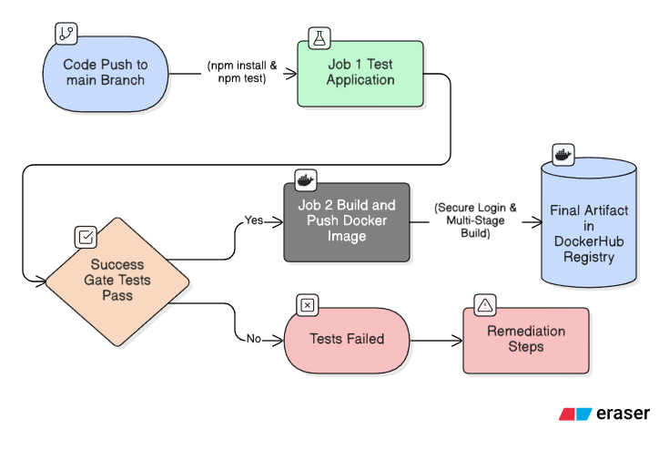
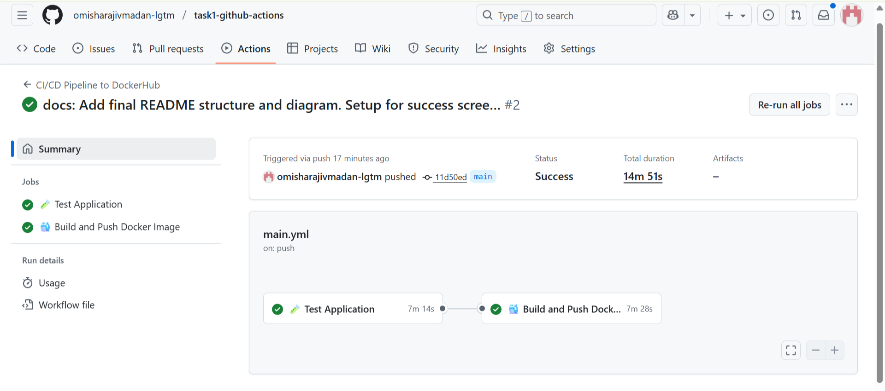
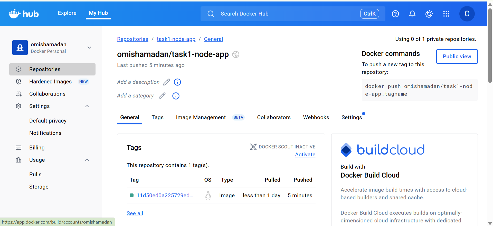
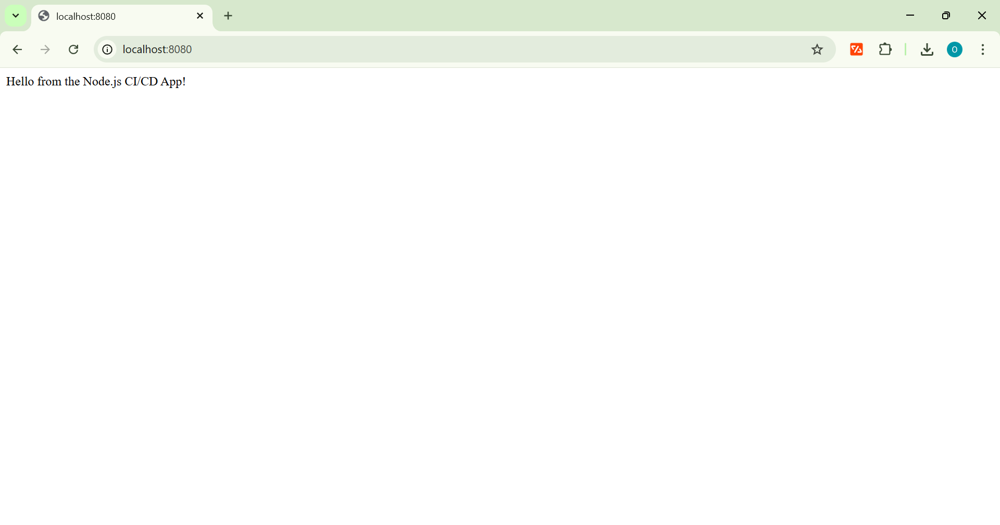

# DevOps Internship - Task 1: Automated CI/CD Pipeline

## Project Overview

This repository contains the solution for **Task 1: Automate Code Deployment Using CI/CD Pipeline (GitHub Actions)**. The primary objective of this project was to establish a fully automated Continuous Integration (CI) and Continuous Deployment (CD) workflow for a web application.

### Key Achievements:
* **Complete CI/CD Automation:** Set up a pipeline to automatically test, build, and deploy the application upon every push to the `main` branch.
* **Containerization:** Utilized **Docker** to containerize a sample **Node.js** web application for consistent and portable deployment.
* **Secure Deployment:** Leveraged **GitHub Actions** and **GitHub Secrets** to securely authenticate and push the final Docker image to **DockerHub**.

### Tools Used:
* **CI/CD Orchestration:** GitHub Actions
* **Source Control:** GitHub
* **Application Runtime:** Node.js
* **Containerization:** Docker
* **Image Registry:** DockerHub

## Architecture & CI/CD Flow

The pipeline is defined in the `.github/workflows/main.yml` file and is structured as a robust, sequential, two-job process. This design ensures that every deployment is preceded by a successful set of continuous integration checks. The entire process is triggered automatically by a `git push` event to the **`main`** branch.

### Visual Architecture Flow

This diagram illustrates the flow and strict dependency chain implemented in the GitHub Actions workflow:



### CI/CD Workflow Breakdown

The pipeline is separated into two distinct, dependent jobs running on a GitHub-hosted `ubuntu-latest` runner.

#### 1. Job 1: Test Application 🧪 (Continuous Integration)

This job serves as the primary quality gate for the pipeline.

* **Objective:** To execute all necessary static analysis and unit tests before committing to a resource-intensive Docker build.
* **Key Steps:**
    * **Setup:** Checks out the code and sets up the Node.js runtime environment.
    * **Testing:** Executes the `npm ci` (clean install) and `npm test` scripts, verifying the application's stability and dependency integrity.
* **Success Gate:** The entire job must pass (exit code `0`) to prevent faulty code from proceeding to the deployment phase.

#### 2. Job 2: Build and Push Docker Image 🐳 (Continuous Deployment)

This job handles the creation and publication of the final deployment artifact.

* **Dependency:** The job includes a critical `needs: test` clause, ensuring it executes only after the Test Application job successfully completes.
* **Key Steps:**
    * **Secure Login:** Uses the `docker/login-action` and **GitHub Secrets** (`DOCKERHUB_USERNAME`, `DOCKERHUB_TOKEN`) to authenticate against the DockerHub Registry.
    * **Build:** Executes a multi-stage Docker build using the provided `Dockerfile`. This process creates a small, production-ready image.
    * **Push:** Publishes the resulting image to DockerHub. The image is tagged with the unique Git **Commit SHA** for immutable version traceability and rollback capability.

## 🟢 Pipeline Execution Proof (Visual Evidence)

The successful completion of the workflow validates the entire automated process, from testing to secure deployment.

### Successful Workflow Run
 

### Artifact Traceability Proof


## Security and Professional Standards

### Secure Credential Management
A key principle of this CI/CD implementation is the protection of sensitive credentials. The process uses **GitHub Secrets** to secure access to the Docker image registry.

* The **`DOCKERHUB_USERNAME`** and **`DOCKERHUB_TOKEN`** are stored securely in the repository settings.
* These values are injected into the pipeline at runtime via the `secrets` context and are never exposed in the workflow file (`main.yml`) or the pipeline logs. This design directly addresses the need for **securing secrets in GitHub Actions**.

### Multi-Stage Docker Build
The `Dockerfile` utilizes a **multi-stage build** approach, which is a best practice for production environments.

* It separates the environment used for installing dependencies (the 'build-stage') from the final runtime image.
* This approach ensures the final image is **lightweight** and only contains the necessary production files, improving security and deployment speed.

### Immutable Artifact Tagging
The final Docker image is tagged using the unique Git **Commit SHA** (`${{ github.sha }}`) instead of relying solely on the mutable `latest` tag. This guarantees that every deployed artifact can be traced back to the exact code change that produced it.

## Application Verification

The final deliverable is a functional Docker image available in DockerHub. Here are the steps to verify the application is running correctly:

### 1. Artifact Verification (DockerHub)

The successful completion of the pipeline guarantees the image is available in the DockerHub repository under the following naming convention:

* **Repository:** `DOCKERHUB_USERNAME/task1-node-app`
* **Tag:** `<Unique Git Commit SHA>` (e.g., `f89a2e0a7a3b...`)

### 2. Local Execution

To run the final container and verify the deployed Node.js application is working, execute the following commands locally:

1.  **Pull the Image:** Pull the latest successful image from DockerHub.
    ```bash
    docker pull DOCKERHUB_USERNAME/task1-node-app:<COMMIT_SHA>
    ```
2.  **Run the Container:** Run the container, mapping the internal port 3000 (exposed in the `Dockerfile`) to an external host port 8080.
    ```bash
    docker run -d -p 8080:3000 --name task1_app DOCKERHUB_USERNAME/task1-node-app:<COMMIT_SHA>
    ```
3.  **Verify Output:** Access the running application in a web browser: `http://localhost:8080/`
    * **Expected Result:** The browser should display the message: "Hello from the Node.js CI/CD App!"

    The following image confirms the application is running as expected on the locally executed Docker container:

